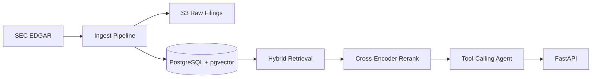

# Hyper-Diligence

## What & Why

Hyper-Diligence is a retrieval-augmented due-diligence analyst over SEC filings. It ingests recent 10-Ks and 8-K earnings releases from EDGAR, stores raw filings in S3, chunks and embeds passages into pgvector, retrieves with dense vectors plus BM25, reranks with a CPU cross-encoder, and answers through a raw OpenAI tool-calling agent with inline filing citations.

## Architecture

## Retrieval Evals

<!-- EVALS_START -->
Pending: run `python -m app.evals.run_evals` after building a hand-verified gold set.
<!-- EVALS_END -->

## Example Q&A

Pending: add three verified `/ask` examples with citations after ingestion.

## Quickstart

1. Copy `.env.example` to `.env` and fill in `OPENAI_API_KEY`, `S3_BUCKET`, and AWS credentials.
2. Start Postgres: `docker compose up -d db`.
3. Initialize the schema: `python -m app.db --init`.
4. Check credentials: `python -m app.preflight`.
5. Start the API: `uvicorn app.main:app --reload`.
6. Ingest the target corpus: `python -m app.ingest.pipeline --tickers AAPL MSFT NVDA JPM TSLA`.
7. Search: `curl "http://localhost:8000/search?q=Apple%20services%20segment%20growth"`.
8. Ask: `curl -X POST http://localhost:8000/ask -H "Content-Type: application/json" -d '{"question":"What risks does Apple flag around supply chain concentration?"}'`.

## Live Demo

Pending: add the EC2 Elastic IP or domain after deployment.
