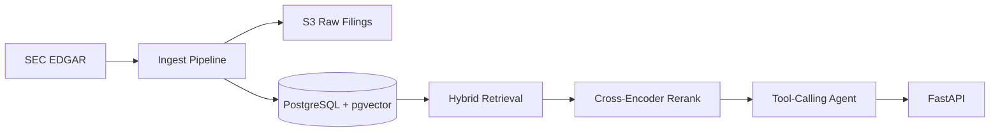

# Hyper-Diligence

## What & Why

Hyper-Diligence is a retrieval-augmented due-diligence analyst over SEC filings. It ingests recent 10-Ks and 8-K earnings releases from EDGAR, stores raw filings in S3, chunks and embeds passages into pgvector, retrieves with local sentence-transformers embeddings plus BM25, reranks with a CPU cross-encoder, and answers with inline filing citations. The default path is free to run locally; OpenAI can be re-enabled later as an optional provider.

## Architecture

## Retrieval Evals

<!-- EVALS_START -->
| Mode | Recall@5 | Recall@10 | MRR |
|---|---:|---:|---:|
| dense | 0.900 | 0.900 | 0.703 |
| bm25 | 0.700 | 0.900 | 0.462 |
| hybrid | 0.800 | 0.900 | 0.700 |
| hybrid_rerank | 1.000 | 1.000 | 0.770 |
<!-- EVALS_END -->

## Example Q&A

Q: What risks does Apple flag around supply chain concentration?

A: Such events can make it difficult or impossible for Apple to manufacture and deliver products, create supply and manufacturing delays and inefficiencies, slow services, increase costs, and negatively affect demand [AAPL 10-K 2025-10-31 §Item 1A.]. Apple also notes potential impacts on supply chain, rare earths and other raw materials, components, pricing, and gross margin [AAPL 10-K 2025-10-31 §Item 7.].

Q: What credit risks does JPMorganChase list?

A: JPMorganChase cites adverse changes in the financial condition of clients, customers, counterparties, central counterparties and other market participants, potential losses from collateral value declines, and concentrations of credit risk [JPM 10-K 2026-02-13 §Item 1A.].

## Quickstart

1. Copy `.env.example` to `.env` and fill in `S3_BUCKET` plus AWS credentials. Leave `EMBEDDING_PROVIDER=local` and `CHAT_PROVIDER=extractive` for the free local path.
2. Start Postgres: `docker compose up -d db`.
3. Initialize the schema: `python -m app.db --init`. Use `python -m app.db --reset` after changing embedding dimensions.
4. Check credentials: `python -m app.preflight`.
5. Start the API: `uvicorn app.main:app --reload`.
6. Open the workbench at `http://localhost:8000/`. API docs remain available at `/docs`.
7. Ingest the target corpus: `python -m app.ingest.pipeline --tickers AAPL MSFT NVDA JPM TSLA`.
8. Search: `curl "http://localhost:8000/search?q=Apple%20services%20segment%20growth"`.
9. Ask: `curl -X POST http://localhost:8000/ask -H "Content-Type: application/json" -d '{"question":"What risks does Apple flag around supply chain concentration?"}'`.

## Live Demo

Pending: add the EC2 Elastic IP or domain after deployment.

## AWS Deployment

The deploy workflow targets a free-tier-sized EC2 `t3.micro` with Docker Compose. Configure GitHub Actions secrets `EC2_HOST`, `EC2_USER`, `EC2_SSH_KEY`, and `S3_BUCKET`; optionally set `AWS_REGION`, `EDGAR_USER_AGENT`, `POSTGRES_USER`, `POSTGRES_PASSWORD`, and `POSTGRES_DB`. The instance should use an IAM role with least-privilege access to the filings S3 bucket; do not store AWS access keys in the repository or workflow.
